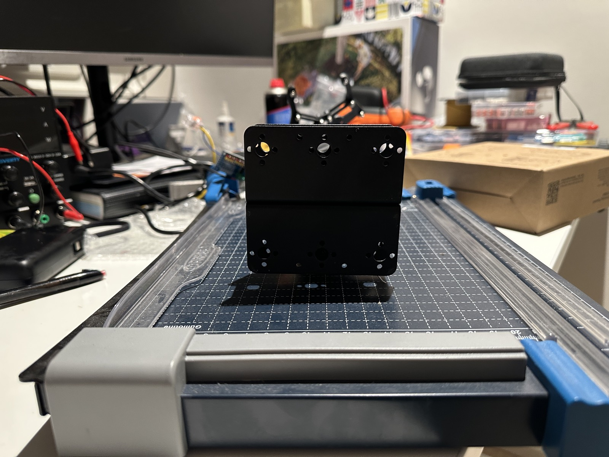
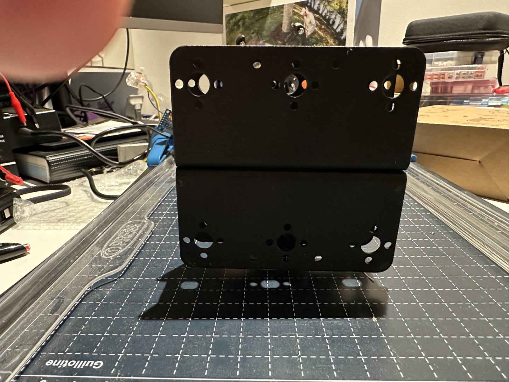
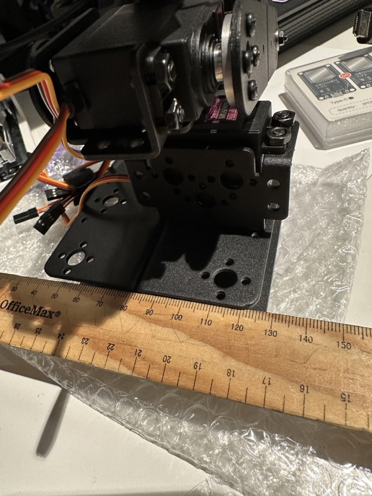
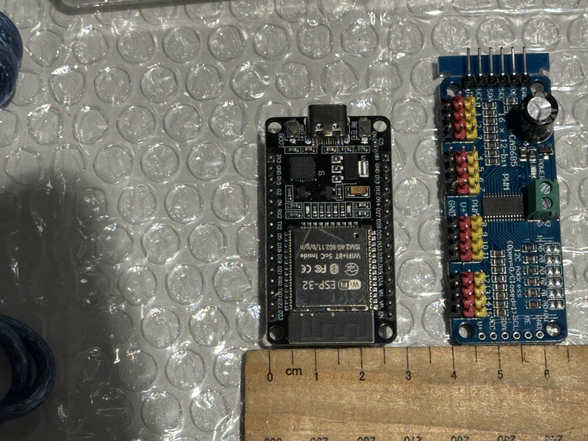
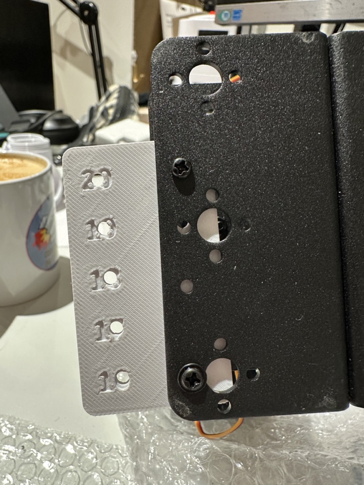
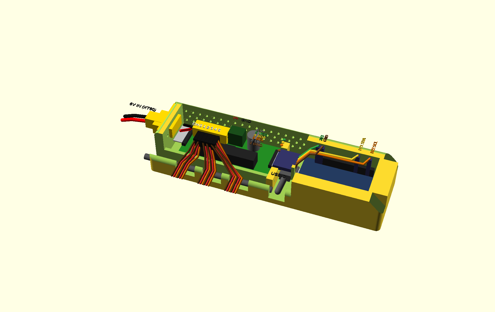
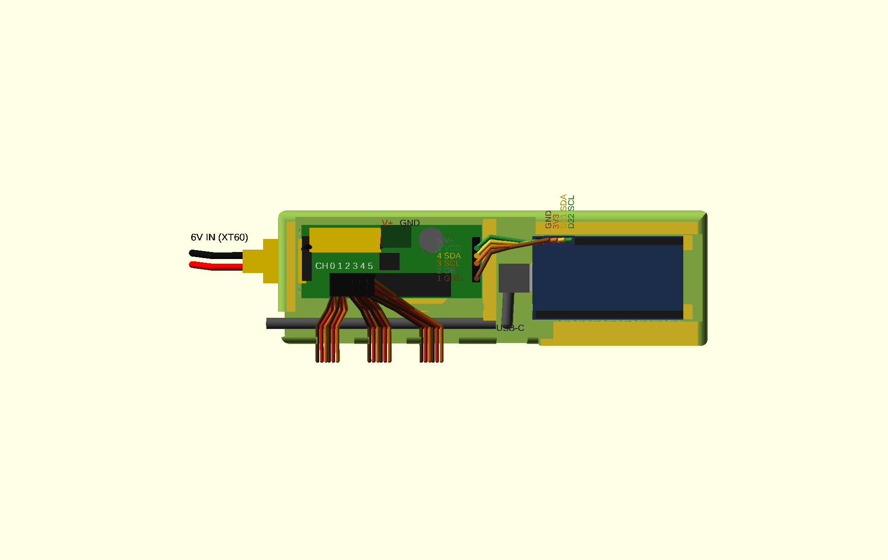

# 3D Printing the Board Mounts

Custom enclosures mount the ESP32 and PCA9685 to the arm's existing metal
brackets. The designs are parametric OpenSCAD sources in `hardware/openscad/`;
you export STLs into `hardware/stl/` yourself after setting the measured
parameters (the bracket hole spacing is a measured input, so no
one-size-fits-all STL is committed).

## Mounting anatomy

The printed "electronics spine" (`hardware/openscad/electronics_spine.scad`)
bolts to the arm's black metal base plates — the folded U-channel bracket at the
arm's foot. Seen face-on, each plate face carries a repeating,
left-right-symmetric hole pattern: paired small holes flanking larger bores,
with a circular bolt-circle around a central bore where a servo boss sits. The
evenly spaced small-hole pairs are the features the mounts' M3 "ear" pairs
(nominally 18 mm center-to-center) bolt through, so the printed part hangs off
the existing plate without new drilling.

<figure markdown>
  { width="600" }
  <figcaption>Face-on view of the arm's black metal U-channel base plate. The hole pattern is what the printed mount's 18&nbsp;mm M3 ear pairs bolt into: note the horizontally paired small holes at the corners and the central bolt-circle around a servo bore. Confirm the actual pair spacing with the <a href="#1b-print-the-spacing-test-plate-first">test plate</a> before committing a mount — these photos show layout, not measurements.</figcaption>
</figure>

<figure markdown>
  { width="600" }
  <figcaption>A second face-on angle of the same plate. The corner clusters each pair two small M3-size holes around a larger bore, and the pattern mirrors left-to-right and repeats on the folded lower face — the symmetry the mount's ear pairs register against.</figcaption>
</figure>

## Workflow

### 1. Measure the bracket holes

The mounts bolt onto the arm's existing metal brackets, and hole spacing is a
**measured input, not a preset** — measure before printing anything:

- Center-to-center spacing of the bracket holes (calipers).
- Hole diameter (and the screw size you'll use).
- Bracket thickness and any clearance constraints around the mounting spot
  (servo horns, wiring paths).

<figure markdown>
  { width="600" }
  <figcaption>The arm's existing metal servo bracket alongside a ruler. A quick ruler read gets you in the ballpark; use calipers on the actual hole centers and diameters for the OpenSCAD parameters.</figcaption>
</figure>

Also measure the footprint of the boards the mount will hold — the ESP32 dev
board and the PCA9685 driver — so the pocket and standoffs fit:

<figure markdown>
  { width="600" }
  <figcaption>The ESP32 dev board (left) and PCA9685 servo driver (right) against a centimetre ruler — a footprint reference for sizing the mount pockets and mounting-hole positions.</figcaption>
</figure>

### 1b. Print the spacing test plate first

Ruler measurements are ballpark; screw holes are not. Before printing any
mount, print `hardware/stl/bracket_test_plate.stl` (source:
`hardware/openscad/bracket_test_plate.scad`) — a 5-minute PLA coupon with
labelled M3 hole pairs at 16/17/18/19/20 mm center-to-center. Hold it on the
bracket and find the row where two M3 screws drop through plate **and**
bracket freely, then set that spacing as `bracket_hole_spacing_mm` in
`hardware/openscad/common_params.scad`. If screws bind even on the correct
row, open up `bracket_screw_hole_d` instead — that's clearance, not spacing.

<figure markdown>
  { width="600" }
  <figcaption>The PLA test plate held up to the black aluminium multi-purpose servo bracket. Each labelled hole pair marks a candidate center-to-center spacing (16–20 mm); sight down each pair against the bracket's own mounting holes to find the row that lines up, then use that number as <code>bracket_hole_spacing_mm</code>.</figcaption>
</figure>

### 2. Set the variables and export

Open the relevant `.scad` file from `hardware/openscad/` in
[OpenSCAD](https://openscad.org/) and set the parameters at the top of the
file (bracket hole spacing, hole diameter, board choice) to your measured
values. Preview (++f5++), render (++f6++), then export the STL (++f7++ or
**File → Export → Export as STL…**). Keep exported STLs in `hardware/stl/` so
the printed geometry stays reproducible.

### 3. Print: PLA first, then PETG

Print every new or re-parameterized design **in PLA first** as a fit check —
it's cheap and fast, and bracket measurements are usually off by a little on
the first try. Bolt the PLA prototype to the actual bracket, seat the board in
it, and check screw alignment, wire clearance, and USB-C access. Iterate the
`.scad` variables until it fits.

Only then print the final part in **PETG** — it tolerates heat and load far
better than PLA for a part living on a moving arm.

## Print settings (Bambu Lab P2S)

| Setting | PLA fit-check | PETG final |
|---|---|---|
| Purpose | dimension/fit verification | permanent mount |
| Walls / perimeters | default (2–3) | **4 or more** |
| Infill | ~15% | **~30%** |
| Layer height | 0.2mm | 0.2mm |
| Notes | any color, fastest profile is fine | dry filament helps PETG surface quality; slower speeds reduce stringing |

## Assembly

1. Bolt the PETG enclosure to the metal bracket using the measured holes.
2. Seat the board; route the I2C run and the thick converter → V+ wires so
   they cannot be snagged by arm motion (see
   [Install → Hardware](install/1-hardware.md) for the wiring rules).
3. Confirm USB-C (ESP32) and the V+ terminal block (PCA9685) stay accessible
   after mounting.

Add photos of your fit checks and final mounts to the [gallery](gallery.md).

## Enclosure print job (phase 2)

Ready-made Bambu Studio project: **`hardware/arm_electronics.3mf`** — one
plate carrying the Pi case (base + two-colour lid) and the electronics
spine (body + two-colour lid). Both lids print face-down with the shared
robot-arm-and-raspberry motif inlaid in two colours (arm + leaf =
filament 2, raspberry = filament 3). Configured for the P2S: 0.4 nozzle,
0.20mm Standard, textured PEI plate, 3x PETG Basic — intended palette
black lid / white arm / red raspberry; map the slots, slice, print. The TPU 95A feet
(`hardware/stl/pi4_case_feet.stl`) print as a separate job — TPU doesn't
co-plate with PETG.

The project is a generated artifact: rebuild it after any `.scad` change
with `./hardware/make_print_project.sh` (needs OpenSCAD and
BambuStudio's CLI; the script bakes plate positions, filament mapping,
bed type, and colours).

### v2 fit-check revisions

Lessons from the first printed set, designed back into the sources:

- **No supports, no bridges**: every wall opening on both enclosures is
  now open-topped — the *lid* closes the top of each port/slot instead
  of the base bridging over it.
- **Pi lid snaps on** (v1's friction skirt wouldn't stay down): ramped
  bumps on the skirt click into small windows through the walls; press a
  fingernail into a window to release. The skirt is also relieved over
  the USB/Ethernet stack and the port-side opening — the "indent" that
  had to be hand-cut into the v1 lid.
- **Pi case is one punch-row lower** (24mm inner) and the GPIO jumpers
  now exit through the same open-topped side opening as the power/HDMI
  ports — no separate slot on the GPIO side.
- **ESP32 rides upside down (pins up)**: v1's rails caught the
  pin-header bases and left no room for connectors on the down-facing
  pins. Flipped, the board rests on two flat pads under its RF can and
  USB-C receptacle, the bay walls guide its sides, and the I2C Dupont
  block presses onto the pins from above — reachable with the board
  installed, no soldering, board stays replaceable, and the spine keeps
  its 24mm profile. Trade-off: the antenna faces the arm bracket
  through the floor — watch `rssi` in `/arm/status` on the first
  wireless soak and revisit if it suffers.
- **Proper 6V power inlet**: the bare-wire pass-through in the entry
  wall is now a panel-mount connector opening on the PCA9685 bay's
  entry edge, sized for an XT60E-M flag mount (parametric — adjust
  `pwr_*` in the spine source for a different connector).
- **Right-angle end headers accounted for**: the PCA9685's 6-pin
  breakouts point horizontally out past both board ends. The board
  datum sits 7.5mm off the entry wall so the unused entry-end pins
  float free, the XT60 inlet rides higher in the entry wall so its
  body and solder cups pass above them, and the divider is notched so
  the I2C Dupont housings plug straight on at the divider end —
  crossing just above the USB-C plug (plug USB first, I2C second).
- **Spine underside clears the arm's own hardware — either way round**:
  both hole-pair centres carry the same relief, a circular recess for
  proud screw heads with an elongated through-slot in its middle for a
  screw-tip-and-nut stack (elongated to match the ±2mm seam-movement
  slots). Mount the spine in whichever orientation; either end absorbs
  either protrusion. Keep the seam screw's tip trimmed near-flush with
  its nut (≤4mm stack) and put washers under all four M3 mount heads
  inside.
- **Low inner walls**: the raceway wall is an 8mm curb and the bay
  divider a plain 10mm wall — with every opening top-loaded and the lid
  closing the roof, wires simply cross over them (servo leads step over
  the curb to the headers; the I2C ribbon crosses the divider, whose
  notch is gone). v1's full-height inner walls dead-ended the servo
  leads and boxed in the USB plug bay.
- **Streamlined outside**: the box is only full-height where the
  interior needs it. The whole front tier (servo slots + cable trough)
  drops to 13mm, and the **ESP32 nose section is centred on the arm's
  mount line**, both long faces sweeping in to it with rounded plan
  blends. The long top edges, nose and entry edges carry proper
  round-overs (convex, upward-facing — they print clean, unlike a
  cove over the open trough, which is why the shape uses round-overs
  rather than scooped curves). The old wide antenna opening is a solid
  rounded nose now, vented by a hexagon through the lid over the RF
  can — and the nose tapers in height as well: an integral 45° roof
  (the steepest support-free interior ceiling) closes the bay's last
  stretch, dropping the profile from 24mm to ~15mm at the tip, starting
  just past the tallest component (the D22 Dupont shell). The lid follows the body as a jogged plate: wide over the PCA
  run (with four feet onto the curb between the servo-lead windows),
  narrow and centred over the nose.

### Component placement

`hardware/openscad/spine_assembly.scad` is a non-printed documentation
model — the spine body with mock boards, the XT60 panel inlet, the
inline XT60 service disconnect (lengthwise along the board's back
edge), the 6V feed and the USB-C run placed in situ:

<figure markdown>
  { width="700" }
  <figcaption>PCA9685 (green) and ESP32 (blue) in their bays; XT60 inlet
  in the entry wall, inline XT60 pair beside the old terminal block,
  USB-C cable in the raceway turning into the plug bay.</figcaption>
</figure>

<figure markdown>
  { width="700" }
  <figcaption>Top view: servo leads enter through the front slots
  straight onto the header strip; the I2C ribbon crosses the divider
  notch to the ESP32.</figcaption>
</figure>
