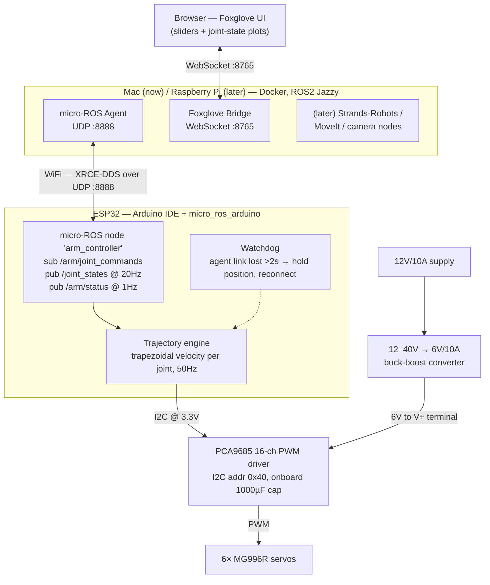

# Architecture

The system is three layers: a browser UI, a Docker host running ROS2 Jazzy,
and the ESP32 firmware. The ESP32 is a real ROS2 node — the host's micro-ROS
agent is transport plumbing, not a protocol translator.

## System diagram

## ROS2 interface

Standard messages only — MoveIt, Strands-Robots, and any ROS2 tool can drive
the arm without translation. Joint names are `joint1`..`joint6`, angles in
radians.

| Topic | Type | Dir | Rate | Purpose |
|---|---|---|---|---|
| `/joint_states` | `sensor_msgs/JointState` | pub | 20Hz | Commanded angle per joint (radians). The MG996R has no feedback, so these are commanded, not measured, positions. |
| `/arm/joint_commands` | `sensor_msgs/JointState` | sub | — | Target angles; optional per-joint velocity. |
| `/arm/status` | `std_msgs/String` (JSON) | pub | 1Hz | Uptime, WiFi RSSI, agent link state, e-stop flag. |

## Firmware modules

All firmware lives in `firmware/arm_controller/`:

| File | Responsibility |
|---|---|
| `ArmController.ino` | `setup()`/`loop()`, micro-ROS node and executor wiring, the agent-link watchdog. |
| `config.h` | WiFi credentials, agent IP, joint limits, per-servo calibration. Gitignored; copy from the committed `config.example.h`. |
| `servo_driver.{h,cpp}` | PCA9685 abstraction. Converts radians to PWM microseconds using per-joint `min_us`, `max_us`, `center_offset`, and `direction`. |
| `trajectory.{h,cpp}` | Trapezoidal-velocity interpolation per joint with configurable maximum velocity and acceleration. |

## Control behavior

- **50Hz servo update loop**, decoupled from ROS message arrival — motion stays
  smooth regardless of network jitter.
- **Smooth replanning** — a new target replans from the current interpolated
  position; the arm never snaps.
- **Software joint limits** clamp every command before execution.
- **No lurch on boot** — servos receive no pulses until the first valid command.
- **Link-loss safety** — if the agent link is lost for more than 2 seconds the
  arm holds its last position (a limp arm would fall), then automatically
  reconnects and re-registers.

## Testing strategy

Trajectory math and the radian→microsecond mapping are pure functions with
host-side C++ unit tests — no hardware required. Hardware behavior is verified
with the scripted bring-up checklist in
[Install → First Motion](install/4-first-motion.md).
