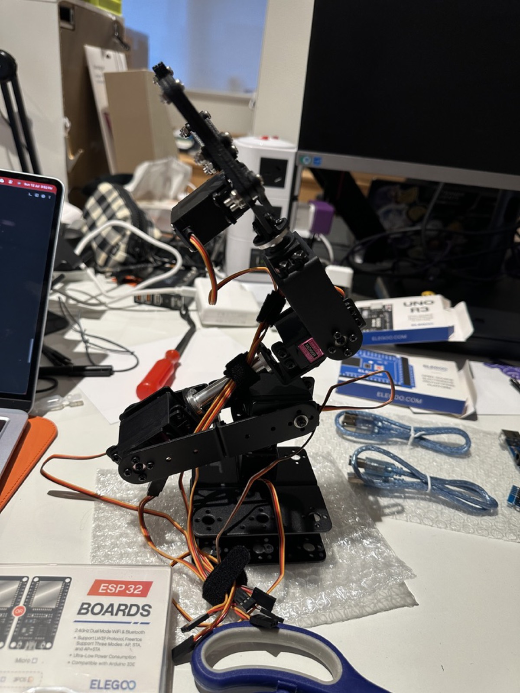
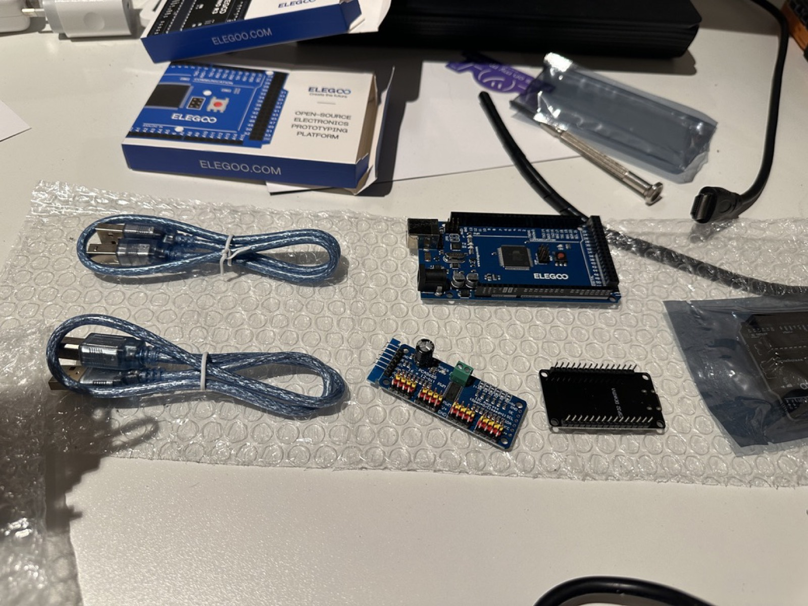
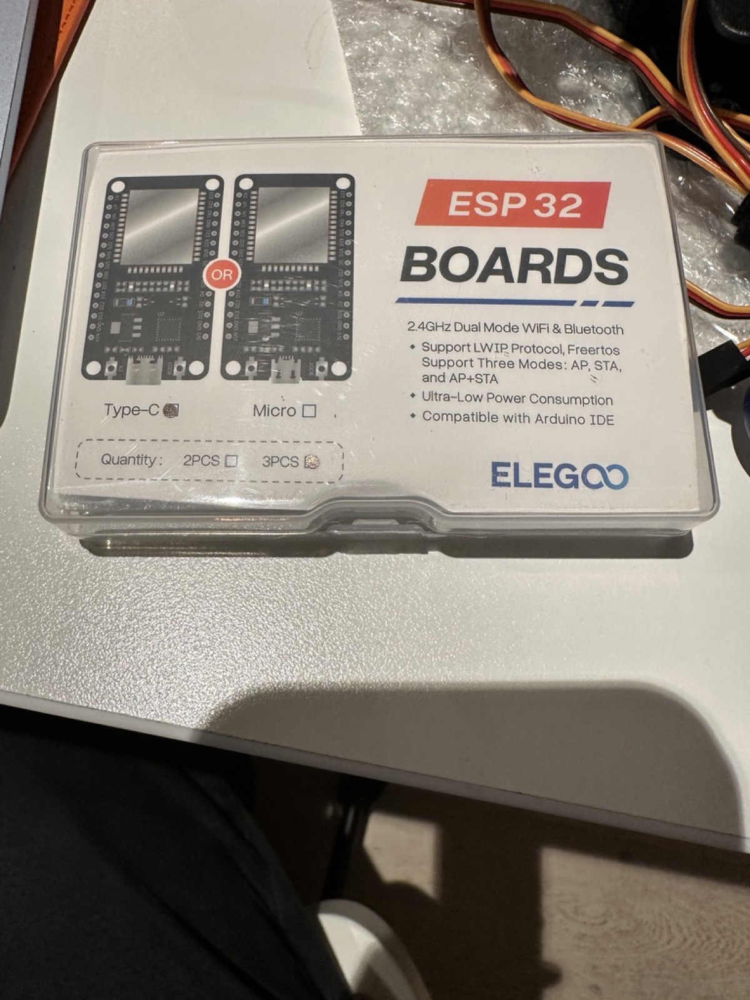
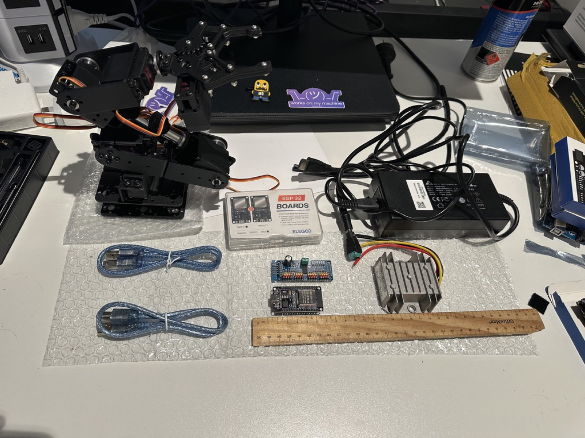
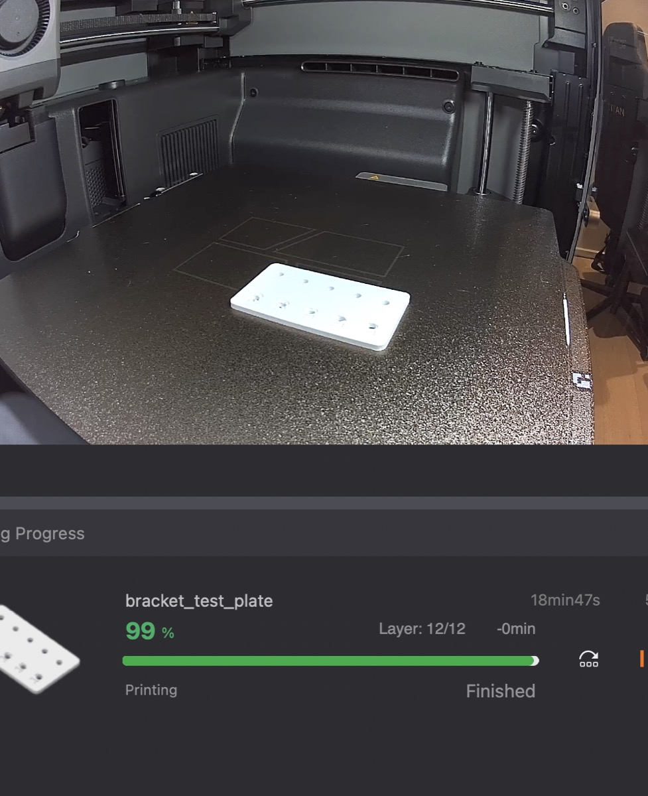

# Gallery

Photos of the build as it progresses — bench tests, calibration, first poses,
and the printed mounts. The gallery starts empty and fills in as milestones
land (first choreographed pose sequence, PLA fit checks, PETG finals).

## Build photos

<figure markdown>
  { width="600" }
  <figcaption>The fully assembled arm on the bench — all six MG996R servos mounted, wiring loomed back to the base.</figcaption>
</figure>

<figure markdown>
  { width="600" }
  <figcaption>Choosing a controller: the Elegoo Mega (rear) versus the smaller black ESP32 with header pins in front of it — the ESP32 won for its WiFi and processing headroom. Alongside: the PCA9685 16-channel servo driver and USB cables.</figcaption>
</figure>

<figure markdown>
  { width="600" }
  <figcaption>The Elegoo ESP32 boards (WiFi + Bluetooth, Arduino-IDE compatible) that run the micro-ROS firmware.</figcaption>
</figure>

<figure markdown>
  { width="600" }
  <figcaption>The whole build laid out: the assembled 6-DOF arm (left), the ESP32 dev board and PCA9685 servo driver, two USB cables, the 12V power brick, and the silver DC-DC buck converter that steps 12V down to the 6V servo rail.</figcaption>
</figure>

<figure markdown>
  { width="600" }
  <figcaption>First print of the project: the bracket-spacing test coupon fresh off the Bambu Lab P2S — 12 layers, 19 minutes, 5 g of PLA. Five labelled M3 hole pairs (16–20 mm) to find the arm bracket's true spacing before printing the real mounts.</figcaption>
</figure>

## Adding photos

Images live in `docs/img/` in the repository.

1. Copy the photo into `docs/img/`. Use short, dated, descriptive names:

   ```
   docs/img/2026-07-15-single-servo-sweep.jpg
   docs/img/2026-07-20-first-pose.jpg
   ```

2. Resize before committing — around 1600px on the long edge keeps the repo
   and page loads reasonable:

   ```bash
   # macOS, in-place resize
   sips -Z 1600 docs/img/2026-07-20-first-pose.jpg
   ```

3. Add an entry to this page with a caption:

   ```markdown
   <figure markdown>
     { width="600" }
     <figcaption>First choreographed pose sequence — all six joints under Foxglove control.</figcaption>
   </figure>
   ```

4. Commit the image and this page together. The docs workflow republishes the
   site on push to `main`.

The [home page](index.md) hero image is `docs/img/hero.jpg`. To swap in a
better photo of the assembled arm later, replace that file (or add a new one
and update the image reference at the top of `docs/index.md`).
