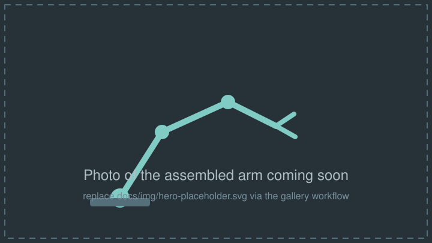

# 6DOF Robot Arm

A hand-built six-degree-of-freedom robot arm, controlled over WiFi as a
first-class ROS2 node. An Elegoo ESP32 runs [micro-ROS](https://micro.ros.org/)
firmware and drives six MG996R servos through a PCA9685 PWM board; a Docker
host (Mac now, Raspberry Pi later) runs the micro-ROS agent and a Foxglove
bridge for browser-based control.

<figure markdown>
  { width="720" }
  <figcaption>Photo coming soon — see the <a href="gallery/">gallery</a> as the build progresses.</figcaption>
</figure>

!!! note "Photo placeholder"
    Once the arm is assembled, add a real photo as `docs/img/hero.jpg` and
    point the image above at it (see the [gallery](gallery.md) workflow).

## Features

- **ROS2-native from day one** — the ESP32 registers as a real ROS2 node
  (`arm_controller`) over WiFi using XRCE-DDS; no custom protocol, no bridge code.
- **Standard messages only** — `sensor_msgs/JointState` in and out, so MoveIt,
  Strands-Robots, and any ROS2 tool can drive the arm without translation.
- **Smooth motion** — a trapezoidal-velocity trajectory engine interpolates
  every joint at 50Hz; new targets replan from the current position (no snapping).
- **Safe by default** — software joint limits clamp every command, servos stay
  idle until the first valid command (no lurch on boot), and if the agent link
  drops for more than 2 seconds the arm holds position instead of going limp.
- **Browser control UI** — Foxglove with a shipped layout: joint sliders and
  live joint-state plots. Zero UI code on the microcontroller.
- **Portable host** — one `docker-compose.yml` runs identically on macOS and
  Raspberry Pi; migration means changing a single IP address in firmware config.
- **Documented and reproducible** — this site covers the
  [architecture](architecture.md), [parts list](parts-list.md),
  [install guide](install/1-hardware.md), [design decisions](design-decisions.md),
  and [3D-printed mounts](3d-printing.md).

## Architecture at a glance

```text
Browser (Foxglove UI)
      │ WebSocket :8765
Docker host (ROS2 Jazzy): micro-ROS Agent + Foxglove Bridge
      │ WiFi (XRCE-DDS over UDP :8888)
ESP32 (micro-ROS node "arm_controller", trajectory engine, watchdog)
      │ I2C @ 3.3V
PCA9685 PWM driver ── 6× MG996R servos (6V/10A converter power)
```

See [Architecture](architecture.md) for the full diagram, ROS2 topic table,
and firmware module breakdown.

## Getting started

The install guide follows the actual bring-up sequence:

1. **[Hardware](install/1-hardware.md)** — wiring and power rules.
2. **[Firmware](install/2-firmware.md)** — Arduino IDE, libraries, config, flash.
3. **[Host software](install/3-host.md)** — Docker, micro-ROS agent, Foxglove.
4. **[First motion](install/4-first-motion.md)** — smoke tests, single-servo
   sweep, calibration, full-arm power-up.

## Roadmap (not built yet)

These are explicitly **phase 2** — the current system does not include them:

- Inverse kinematics / MoveIt integration.
- Camera-based perception (phase 1 only plumbs a webcam for calibration).
- Strands-Robots integration.
- Custom web UI beyond Foxglove (rosbridge + static page, if ever wanted).
- True joint position feedback — the MG996R has none, so the arm reports
  *commanded* angles (see [Design Decisions](design-decisions.md)).
