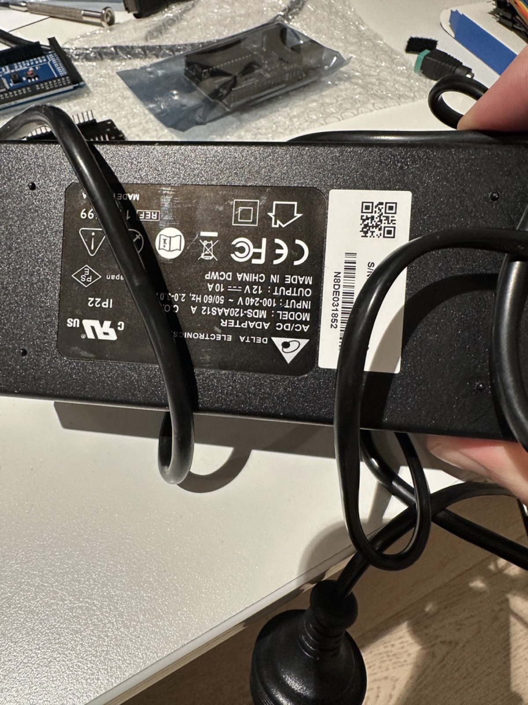

# Install 1/4 — Hardware & Wiring

Wire the electronics before installing any software. The authoritative,
always-current wiring reference is `hardware/wiring.md` in the repository —
this page summarizes it and states the power rules that must never be
violated.

## Power rules (read first)

!!! danger "The 12V supply must NEVER touch the servos or PCA9685 V+"
    MG996R servos accept 4.8–7.2V. Connecting the 12V supply directly to the
    servo rail or the PCA9685 V+ terminal destroys them. The 12V supply feeds
    **only** the buck-boost converter input.

1. **Servo rail path:** 12V/10A supply → converter input; converter **6V**
   output → PCA9685 **V+ terminal block**. The PCA9685's onboard 1000µF
   capacitor absorbs stall spikes.
2. **Keep the converter → PCA9685 wires short and thick** — stall currents are
   large and voltage sag on thin wire causes brownouts and jitter.
3. **ESP32 is powered by USB-C**, never from the servo rail.
4. **Common ground:** the ESP32 ground and the 6V servo rail ground must be
   connected — I2C does not work without a shared reference.
5. **USB-only power is for single-servo bench testing only.** Never move more
   than one servo without the converter connected.

<figure markdown>
  { width="600" }
  <figcaption>The 12V/10A DC supply. Its output feeds <strong>only</strong> the buck-boost converter input — never the servos or the PCA9685 V+ directly.</figcaption>
</figure>

## Connections

| From | To | Notes |
|---|---|---|
| ESP32 SDA | PCA9685 SDA | 3.3V logic; check your exact Elegoo module's pinout (it varies slightly between revisions) against `hardware/wiring.md` |
| ESP32 SCL | PCA9685 SCL | as above |
| ESP32 3V3 | PCA9685 VCC | logic supply for the PCA9685 chip only — **not** V+ |
| ESP32 GND | PCA9685 GND | common ground with the servo rail |
| Converter 6V + | PCA9685 V+ terminal block | short, thick wires |
| Converter 6V − | PCA9685 GND terminal block | short, thick wires |
| 12V supply | Converter input | converter accepts 12–40V in |
| Servos 1–6 | PCA9685 channels 0–5 | joint1 → channel 0 … joint6 → channel 5; mind the signal/V+/GND pin order |

The PCA9685 uses I2C address `0x40` (all address jumpers open — the default).

## Before powering anything

- [ ] Set and **verify the converter output is 6.0V with a multimeter** before
      connecting it to the PCA9685 (adjustable modules often ship at a
      different setpoint).
- [ ] Confirm no servo or PCA9685 V+ path can see 12V.
- [ ] Confirm ESP32 ground and servo-rail ground are common.
- [ ] Leave all servo horns detached until calibration
      ([step 4](4-first-motion.md)) so an uncalibrated command can't strain
      the arm.

Next: [Install 2/4 — Firmware](2-firmware.md).
