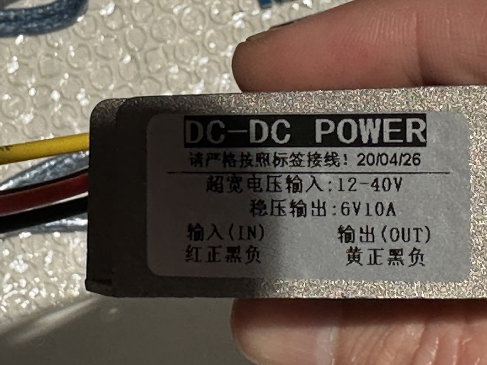
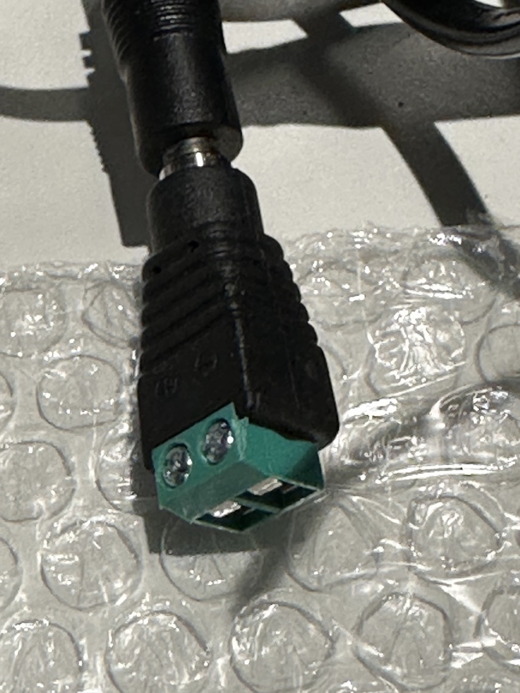
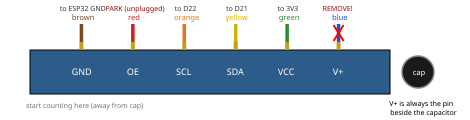
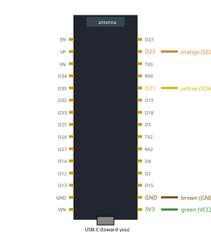
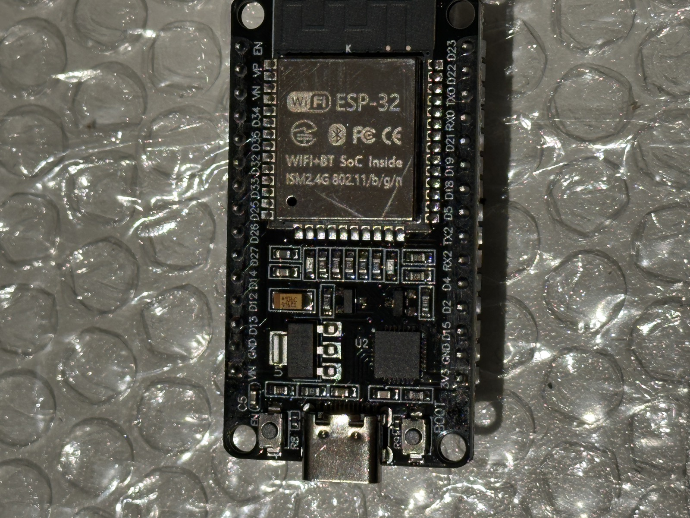

# Install 1/4 — Hardware & Wiring

Wire the electronics before installing any software. The authoritative,
always-current wiring reference is `hardware/wiring.md` in the repository —
this page summarizes it and states the power rules that must never be
violated.

## Power rules (read first)

!!! danger "The 12V supply must NEVER touch the servos or PCA9685 V+"
    MG996R servos accept 4.8–7.2V. Connecting the 12V supply directly to the
    servo rail or the PCA9685 V+ terminal destroys them. The 12V supply feeds
    **only** the buck-boost converter input.

1. **Servo rail path:** 12V/10A supply → converter input; converter **6V**
   output → PCA9685 **V+ terminal block**. The PCA9685's onboard 1000µF
   capacitor absorbs stall spikes.
2. **Keep the converter → PCA9685 wires short and thick** — stall currents are
   large and voltage sag on thin wire causes brownouts and jitter.
3. **ESP32 is powered by USB-C**, never from the servo rail.
4. **Common ground:** the ESP32 ground and the 6V servo rail ground must be
   connected — I2C does not work without a shared reference.
5. **USB-only power is for single-servo bench testing only.** Never move more
   than one servo without the converter connected. (An adjustable bench
   adapter — e.g. a SHNITPWR 3.5–36V unit — set to 6V can substitute for USB
   power in single-servo tests, but its 3A ceiling makes it equally
   unsuitable for multi-servo work.)

<figure markdown>
  { width="600" }
  <figcaption>The 12V/10A DC supply. Its output feeds <strong>only</strong> the buck-boost converter input — never the servos or the PCA9685 V+ directly.</figcaption>
</figure>

<figure markdown>
  { width="600" }
  <figcaption>The DC-DC converter label: <strong>12–40V input, regulated 6V/10A output</strong>. This 6V output is the servo rail.</figcaption>
</figure>

### Converter wire colors

Straight from the unit's label (the Chinese instruction on it translates to
"wire strictly according to the label"):

| Wire | Role | Connects to |
|---|---|---|
| **Red** | Input **+** | 12V supply positive |
| **Black** (paired with red) | Input **−** | 12V supply negative |
| **Yellow** | Output **+** (6V) | PCA9685 **V+** terminal |
| **Black** (paired with yellow) | Output **−** | PCA9685 **GND** terminal |

Red side drinks 12V; yellow side feeds the servos. The two black wires are
both negative but belong to their own bundles — use the one physically
paired with red for input, the one paired with yellow for output.

Before the PCA9685 sees any of it:

1. Power the converter with **only the input connected** and measure
   yellow-to-black with a multimeter: expect **~6.0V**. Only then land it on
   the PCA9685's terminal block.
2. Double-check polarity at the V+ block before switching on — the PCA9685
   has **no reverse-polarity protection**.
3. The output black must share ground with the ESP32 (automatic once both
   sit on the PCA9685's ground rail).

<figure markdown>
  { width="600" }
  <figcaption>A barrel-jack-to-screw-terminal adapter breaks the 12V supply's DC plug out to bare wires for the converter input. Mind polarity — the terminal block is marked + / −.</figcaption>
</figure>

## Connections

### PCA9685 I2C header — identify direction by the capacitor

The 6-pin header order, starting from the end **away** from the silver
electrolytic capacitor, is `GND, OE, SCL, SDA, VCC, V+` — **V+ is always the
pin beside the cap.**

<figure markdown>
  { width="640" }
  <figcaption>This build's 6-wire ribbon on the PCA9685 header. Two wires never reach the ESP32: red (OE) stays parked, and blue (V+) is <strong>removed</strong> — that pin is the 6&nbsp;V servo rail and would destroy the ESP32.</figcaption>
</figure>

### ESP32 connections

| Ribbon color | PCA9685 pin | ESP32 pin | Notes |
|---|---|---|---|
| brown/black (end pin) | GND | `GND` | required common-ground link — I2C is dead/flaky without it |
| red | OE | **leave unplugged** | already pulled low (enabled); future kill-switch option |
| orange | SCL | `D22` (GPIO22) | Arduino `Wire` default clock |
| yellow | SDA | `D21` (GPIO21) | Arduino `Wire` default data |
| green | VCC | `3V3` | logic supply for the PCA9685 chip only — **3.3V, never 5V/VIN** |
| blue (beside cap) | V+ | 🛑 **remove from ribbon** | 6V servo rail — never to the ESP32 |

Pin locations on the 30-pin devkit — hold it **USB-C toward you, antenna
away**; the right-hand row reads `3V3, GND, D15, D2, D4, RX2, TX2, D5, D18,
D19, D21, RX0, TX0, D22, D23` from the USB end:

<figure markdown>
  { width="420" }
  <figcaption>Green (3V3) and brown (GND) land at the near corner; yellow on D21, orange on D22. D-numbers are GPIO numbers.</figcaption>
</figure>

<figure markdown>
  { width="420" }
  <figcaption>The real board for silk-label matching.</figcaption>
</figure>

### Power and servo connections

| From | To | Notes |
|---|---|---|
| Converter 6V + (yellow) | PCA9685 V+ terminal block | short, thick wires |
| Converter 6V − (black) | PCA9685 GND terminal block | short, thick wires |
| 12V supply | Converter input (red +, black −) | converter accepts 12–40V in |
| Servos 1–6 | PCA9685 channels 0–5 | joint1 → channel 0 … joint6 → channel 5; mind the signal/V+/GND pin order |

The PCA9685 uses I2C address `0x40` (all address jumpers open — the default).

!!! tip "Printable bench sheet"
    All of this — plus safety rules and a bring-up checklist — is on the
    3-page A4 [wiring bench sheet](https://github.com/jsamuel1/6dof-fun/blob/main/hardware/wiring-bench-sheet.pdf)
    (a living artifact: regenerate it with
    `uv run --with reportlab python hardware/make_bench_sheet.py`, which also
    rebuilds the pinout diagrams on this page).

## Before powering anything

- [ ] Set and **verify the converter output is 6.0V with a multimeter** before
      connecting it to the PCA9685 (adjustable modules often ship at a
      different setpoint).
- [ ] Confirm no servo or PCA9685 V+ path can see 12V.
- [ ] Confirm ESP32 ground and servo-rail ground are common.
- [ ] Leave all servo horns detached until calibration
      ([step 4](4-first-motion.md)) so an uncalibrated command can't strain
      the arm.

Next: [Install 2/4 — Firmware](2-firmware.md).
