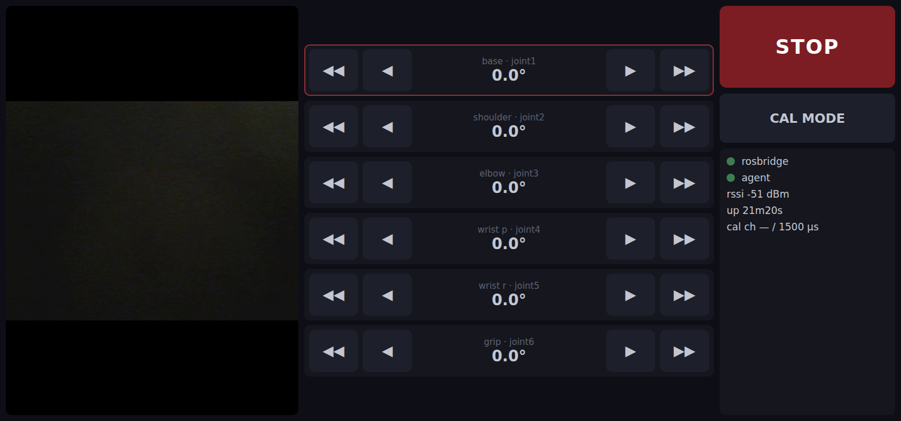

# 6. Touchscreen Control Panel

A touch-first jog + calibrate panel for the bench screen (we use a
Magedok T101F, 1540×720, on the `armdell` host). The same page works
from any browser on the LAN: **http://\<host\>:8088**.

Design: `docs/superpowers/specs/2026-07-19-touchscreen-ui-design.md`.



## What it does

- **Jog**: per-joint step buttons — ◀◀/▶▶ = 10°, ◀/▶ = 2°. Discrete
  taps only (no sliders — a stray swipe must never command a sweep).
  Publishes `sensor_msgs/JointState` to `/arm/joint_commands`.
- **STOP**: publishes the firmware e-stop (`x` on `/arm/cal`). No
  confirmation dialog, by design.
- **CAL MODE**: tap a joint row to select its channel, then nudge the
  raw pulse width (−50/−10/+10/+50 µs, same `/arm/cal` alphabet as the
  USB diag console). Live `cal_us` echoes in the status strip.
- **Camera**: MJPEG of `/image_raw`; tap the image to rotate 90°.
- **Status**: rosbridge + agent link dots, RSSI, uptime, e-stop flag.
  If rosbridge drops, every command button disables until reconnect.

## Services

Three compose services in `host/pi/docker-compose.yml` provide the
page and its plumbing (started with the rest of the stack):

| Container | Port | Role |
|---|---|---|
| `arm-web` | 8088 | nginx serving `host/web/` (static, no build step) |
| `arm-rosbridge` | 9090 | rosbridge websocket — JSON ⇄ DDS for roslibjs |
| `arm-web-video` | 8080 | `web_video_server` — `/stream?topic=/image_raw&type=mjpeg` |

## Kiosk on the host

The screen boots straight into the panel via `cage` (a single-app
Wayland compositor) running Chromium fullscreen. On the host:

```sh
sudo apt-get install -y cage curl
sudo snap install chromium
sudo systemctl disable getty@tty1   # kiosk owns tty1
```

`/etc/systemd/system/kiosk.service`:

```ini
[Unit]
Description=Arm touchscreen kiosk (cage + chromium)
After=systemd-user-sessions.service docker.service
Wants=docker.service
Conflicts=getty@tty1.service

[Service]
User=jsamuel
PAMName=login
TTYPath=/dev/tty1
TTYReset=yes
TTYVHangup=yes
TTYVTDisallocate=yes
StandardInput=tty-fail
UtmpIdentifier=tty1
UtmpMode=user
Restart=always
RestartSec=5
ExecStartPre=/bin/sh -c 'until curl -sf http://localhost:8088 >/dev/null; do sleep 2; done'
ExecStart=/usr/bin/cage -- /snap/bin/chromium --ozone-platform=wayland \
  --kiosk --noerrdialogs --disable-pinch \
  --overscroll-history-navigation=0 http://localhost:8088

[Install]
WantedBy=multi-user.target
```

```sh
sudo systemctl daemon-reload
sudo systemctl enable --now kiosk.service
```

### Single-output: disable the laptop's internal panel

On a laptop host, `cage` tiles **every** connected DRM output into one
wide logical desktop and stretches the kiosk window across all of them —
so with the lid panel (`eDP-1`) still active alongside the Magedok
(`HDMI-A-1`), the UI spans both screens and, worse, the touchscreen's
absolute coordinates map into the combined space and land on the wrong
panel. Taps appear to do nothing.

Fix: disable the internal connector at the kernel level so only the
Magedok remains. Add a GRUB drop-in and reboot:

```sh
echo 'GRUB_CMDLINE_LINUX_DEFAULT="$GRUB_CMDLINE_LINUX_DEFAULT video=eDP-1:d"' \
  | sudo tee /etc/default/grub.d/99-kiosk-display.cfg
sudo update-grub
sudo reboot
```

After reboot, `for c in /sys/class/drm/card*-*/status; do echo "$c $(cat
$c)"; done` should show only `HDMI-A-1: connected`, and the panel fills
the Magedok at its native 1540×720. (Find your internal connector name
in that same list — it is `eDP-1` on most laptops.)

## Safety notes

- The UI clamps jogs to ±90°, but the **firmware's soft limits are the
  authority** — the page is a remote control, not a safety system.
- The STOP button is an e-stop for *commanded motion*; on agent-link
  loss servos hold position (see the firmware watchdog notes in
  [First Motion](4-first-motion.md)).
- Anyone on the LAN can open the page and move the arm. Fine for a
  home bench; don't port-forward it.
